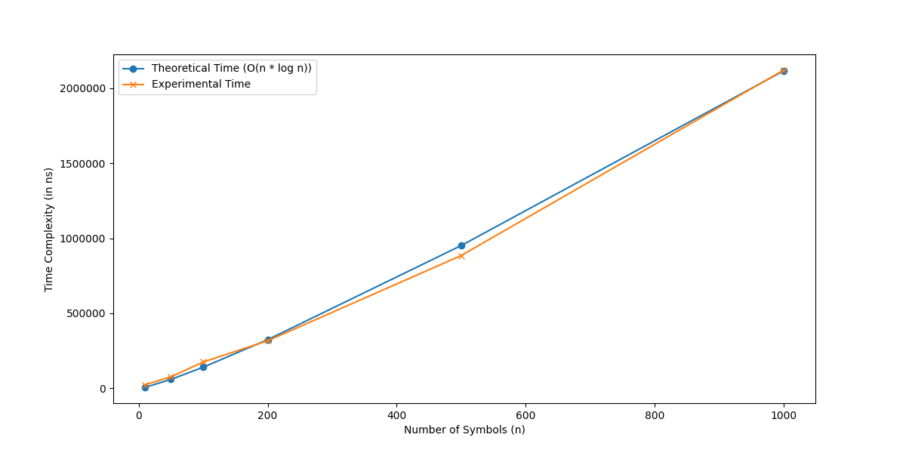

# Huffman Encoding Algorithm
## Overview 
This project implements the Huffman Encoding Algorithm, a widely used data compression technique that assigns variable-length codes to input characters based on their frequencies. The algorithm is used for lossless data compression, reducing the amount of space required to store or transmit data.

## How Huffman Encoding Works
Frequency Count: Each character is associated with its frequency of occurrence.
Min-Heap (Priority Queue): A binary tree is built using a min-heap where each node represents a symbol and its frequency.
Tree Construction: The two nodes with the lowest frequencies are merged to create a new internal node with their combined frequency. This process repeats until a single root node remains, representing the complete Huffman tree.
Code Assignment: A binary code is assigned to each character based on its position in the tree. Left branches correspond to 0 and right branches to 1, leading to shorter codes for more frequent characters.

## Theoretical Analysis
•	This problem statement is on the Huffman encoding problem, a lossless data compression algorithm. It’s a classic example of a greedy algorithm, here a variable-length prefix code is assigned to the input characters, and the length of the codes assigned is based on the frequencies of the corresponding characters in the text. The algorithm involves various steps such as:
1.	Creating a priority queue using a min-heap binary tree on the frequency of symbols.
2.	Build the Huffman Tree
3.	Traverse through the Huffman tree to generate the encoding table
4.	Assign shorter codes to symbols with higher frequencies
•	The overall time complexity of Huffman encoding depends on analyzing the key steps in the algorithm: constructing the priority queue (min-heap), building the Huffman tree, generating the Huffman codes, and encoding the data. Each of these operations has its own time complexity, and we combine them to compute the total time complexity.
•	In this algorithm time complexity to build the priority queue using min-heap takes O(n) time, since building a heap from an unsorted list can be done in linear time. It involves constructing the min-heap n symbols by inserting each symbol with its frequency into the heap. In the next step of building the Huffman tree, it repeatedly merges nodes with the smallest frequencies, performing n - 1 iterations. Each extraction from and insertion into the min-heap requires O(log n) time due to the logarithmic height of the heap. Therefore, the total time complexity for building the tree is O(n log n). Once the tree is built, the algorithm must traverse the tree to generate the binary codes for each symbol. Since there are n symbols, this traversal takes O(n) time, where n is the number of symbols.
•	The total time complexity is the sum of these steps:
O(Building the Priority Queue) + O(Building the Huffman Tree) + O(Generating Huffman Code) = O(n) + O(n log(n)) + O(n)   
•	Since O(n) and O(n log n) are the dominant terms, we can simplify the sum by focusing on the largest term, which is O(n log n). 
O(n) + O(n log(n)) + O(n) + O(n)  = O(n log(n))
•	Thus, the overall time complexity of the Huffman encoding algorithm is O(n log n). 

## Time Complexity
The overall time complexity of the Huffman Algorithm is O(n log n), where n is the number of unique symbols. This complexity arises due to the heap operations involved in building the Huffman tree.

## Graph Observation
From the above graph, it can be observed that the experimental values and theoretical values are running very close to each other, but it is distinct at a few points, for values of n=50, 100, and 500. Also, they are almost close to intersecting at a few points for values of n=10, 200, and 1000.
The linear relationship between the number of symbols and the time complexity indicates that the algorithm scales well with the input size.

## Conclusions
Huffman encoding problem is used for lossless data compression, the primary goal is to represent data of variable length, where characters with high frequency are represented with short binary codes and vice versa. The close alignment of the theoretical and experimental results confirms the algorithm's efficiency, validating that the theoretical analysis of O(n log(n)) is correct. 

